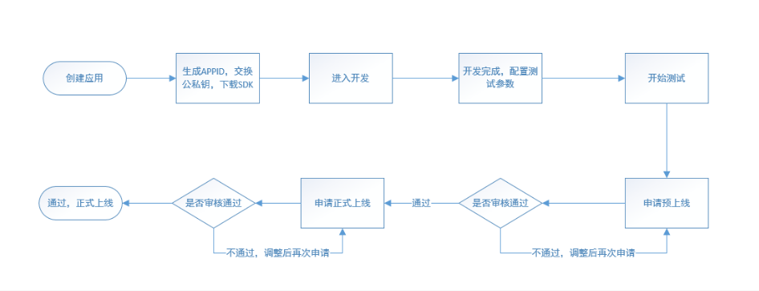

# 接入说明
更新时间：2016-10-10

已通过实名认证的接入者，可调用开放平台公布的API，并基于这些API进行开发。

**接入流程如下：**

### 创建应用

接入者可以在开放平台最多创建多个应用，应用创建成功后，系统将返回该应用所对应的唯一APPID和服务商公钥，作为该应用调用API时验证所用。

接入者也需要以RSA算法生成接入方签名公钥并上传，作为与系统互信的验签依据。 RSA使用说明同时，接入者可下载SDK供参考。SDK还可以在“应用详情”中查看和刷新。