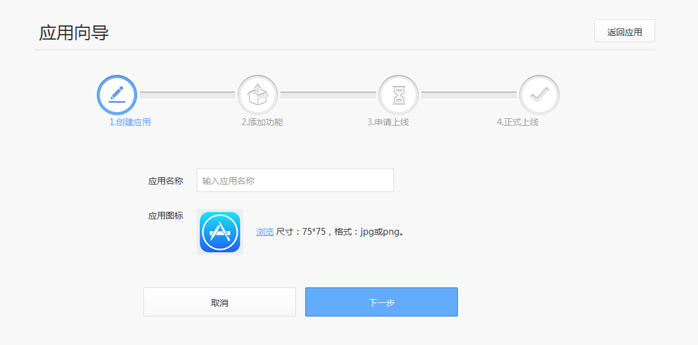
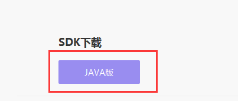

# SDK下载
更新时间：2016-10-10

1.开发人员登录开放平台成功创建应用之后可下载SDK资源，如下图：（若已创建过应用，可直接在应用详情页面查看SDK）

2.将依赖包导入到软件项目

解压下载的zip文件：

vfinance-sdk-java**************-source.jar

vfinance-sdk-java**************.jar

其中vfinance-sdk-java**************-source.jar为sdk源码，vfinance-sdk-java**************.jar为编译后的二进制文件。

请将vfinance-sdk-java**************.jar集成到您的项目中。

