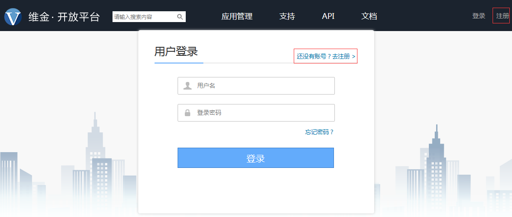
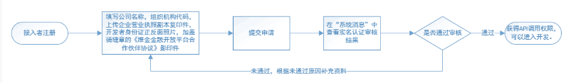

# 用户注册
更新时间：2016-10-10
## 新用户注册
如首次使用维金开放平台需要先注册账号，点击图中的“注册” ；或者点击登录，选择“还没有账号，去注册”

## 实名认证

经过实名认证审核的接入者，可获得API调用权限。

接入者需以公司法人的身份申请，并提交有效的企业资料文档和加盖公司骑缝章的《维金金融开放平台服务伙伴协议》，3个工作日内可收取通过或不通过实名认证的系统回复。

未通过实名认证审核的接入者，可补充相关资料后再次提交实名认证申请。

**实名认证流程如下：**

